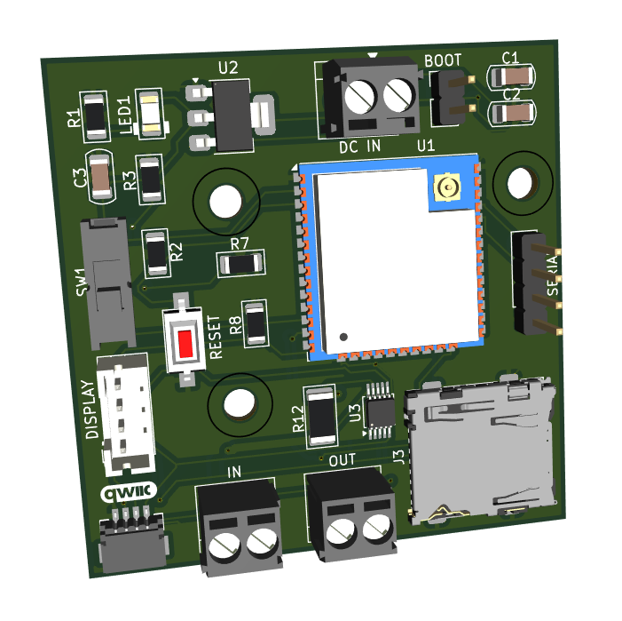
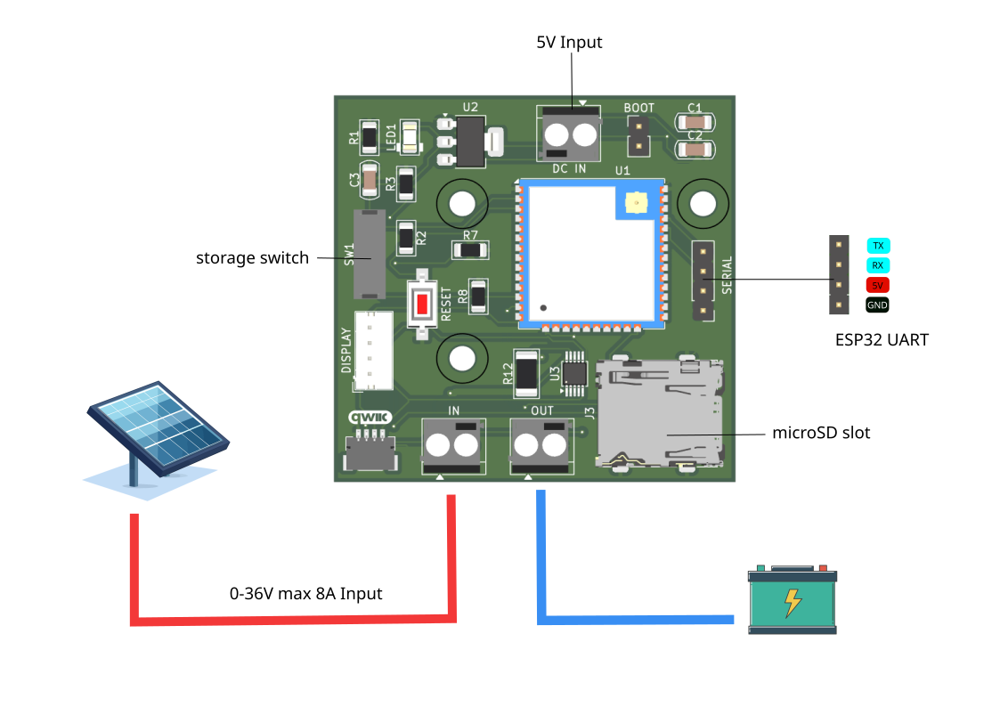
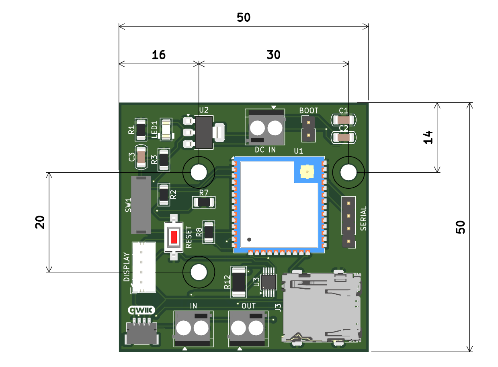

# ESP32 Current Meter and data logger

The ESP32 Data Logger is a custom board that helps makers to monitor the power consumption of small electronic devices, with the ability to log data onto a microSD card. Also, you can monitor all kind of sensor connected via the Qwiic connector.

---

## Pinout

---
---

## 🧩 Specifications

- **Power Supply:** 5V DC input  
- **Qwiic Connector:** For I²C peripherals (3,3V)  
- **Display Connector:** For displays working at 5V  
- **SD Slot:** For storing the measurements in a microSD card
- **INA226:** Up to 8A and 250uA resolution for current monitoring 

---

---
